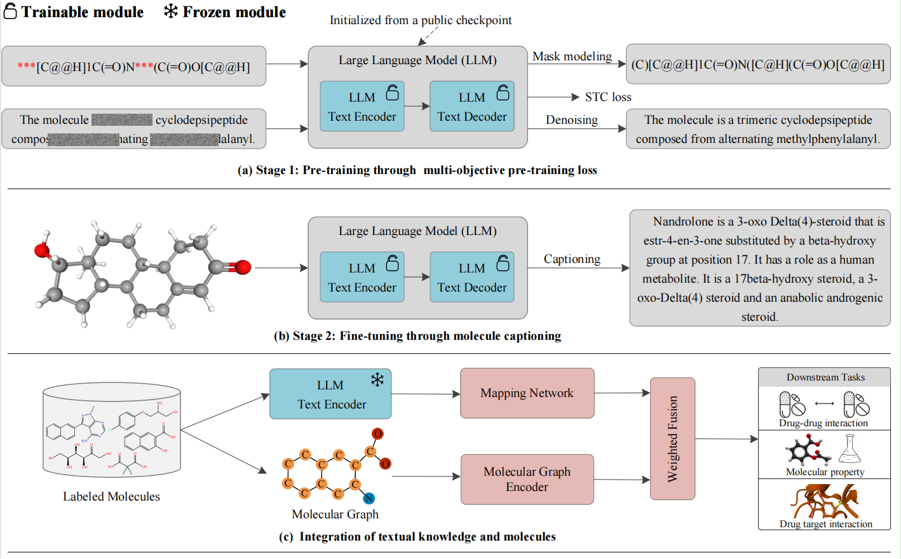

# Mol-L2: Transferring Text Knowledge with Frozen Language Models for Molecular Representation Learning

Supporting Information for the paper "Mol-L2: Transferring Text Knowledge with Frozen Language Models for Molecular Representation Learning."

The main novelty of Mol-L2 is the use of a two-stage training pipeline to align text and chemical spaces, where stage 1 pre-trains the language model using a specially constructed multi-objective loss, and stage 2 fine-tunes on molecular captioning. Subsequently, the output of the language model encoder is converted into a fixed-length text-enhanced embedding via a lightweight mapping network. Furthermore, a dedicated encoder containing information propagation of specific functional groups is designed to generate molecular initial representation and integrated with the text-enhanced embeddings using a weighted fusion module. Finally, the enhanced molecular representation is utilized for various downstream tasks through an additional output layer. The performance of the proposed Mol-L2 is tested on several standard benchmarks for molecular machine learning, including molecular properties prediction, drug-target interaction (DTI), and drug-drug interaction (DDI). 

### HuggingFace model checkpoints

Pretrained t5.1.1.small checkpoints on:

+ [t5.1.1.small](https://github.com/google-research/text-to-text-transfer-transformer/blob/main/released_checkpoints.md#t511) (~77 million parameters)

## Dataset

All data used in this paper are uploaded and can be accessed. 
- The pre-training dataset can be obtained from the following link: [Link](https://pan.baidu.com/s/1VYjZi6wHAjgOFHMYcS3sjA?pwd=d7zn)
- Finetuning&Captioning datasets: ChEBI-20_data
- MPP datasets: ClinTox, BBBP, BACE, ESOL, FreeSolv, Lipo
- DDI datasets: ZhangDDI, ChCh-Miner, DeepDDI
- DTI datasets: Drugbank

## To run the training procedure
- Run pretrains.py to pre-train the model.
- Run pretrains.py to finetuning the model.  

## To run the testing procedure
- Run finetune.py to testing the model.  

The core code of Mol-L2 will be published when the paper review is complete. 
Please stay tuned for updates!
Thank you.

## Acknowledgement
- PyTorch implementation of MolCLR: [https://github.com/yuyangw/MolCLR](https://github.com/yuyangw/MolCLR)
- Constructed elements knowledge graph ElementKG: [https://github.com/HICAI-ZJU/KANO](https://github.com/HICAI-ZJU/KANO)
- Graph adaptive augmentation: [https://github.com/CRIPAC-DIG/GCA](https://github.com/CRIPAC-DIG/GCA)
- MolT5: [https://github.com/blender-nlp/MolT5](https://github.com/blender-nlp/MolT5)

